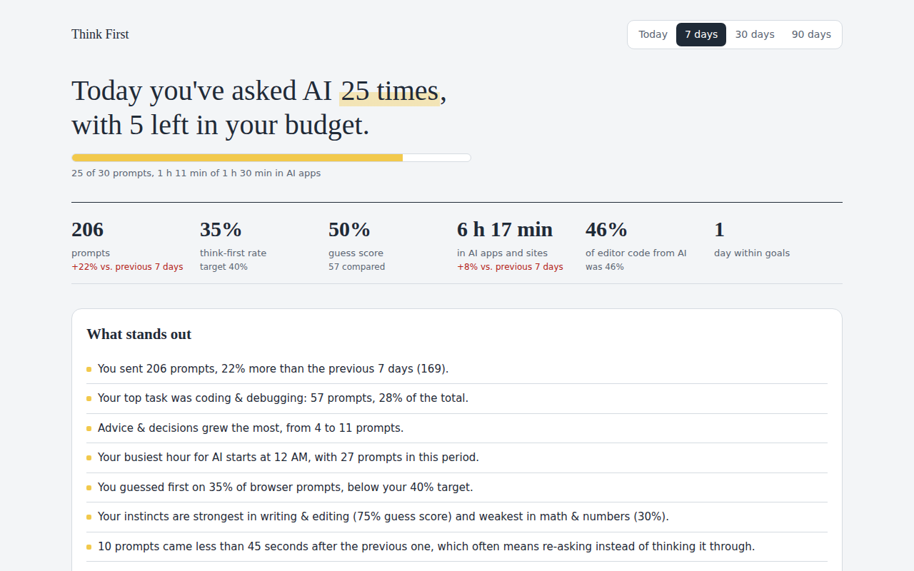

<p align="center"></p>
<h1 align="center">Think First</h1>
<p align="center"><b>Think first. Then ask AI.</b></p>

<p align="center">
  <a href="https://thinkfirst-app.github.io/">Website</a> ·
  <a href="https://github.com/thinkfirst-app/thinkfirst-app.github.io/releases/latest">Download</a> ·
  <a href="PRIVACY.md">Privacy</a> ·
  <a href="CHANGELOG.md">Changelog</a> ·
  <a href="CONTRIBUTING.md">Contributing</a>
</p>

<p align="center">
  <a href="https://github.com/thinkfirst-app/thinkfirst-app.github.io/releases/latest"></a>
  <a href="https://github.com/thinkfirst-app/thinkfirst-app.github.io/actions/workflows/ci.yml"></a>
  <a href="LICENSE"></a>
  <a href="PRIVACY.md"></a>
</p>

Think First has you write a quick guess before AI answers, shows you how close you were, and keeps an honest record of how much you rely on AI across your browser, apps, and code editor. Everything stays on your computer: no server, no account, no analytics.



## Install

Download the latest packages from the [Releases page](https://github.com/thinkfirst-app/thinkfirst-app.github.io/releases/latest). Step-by-step setup for each part is on the [website](https://thinkfirst-app.github.io/#install).

| Part | File | What it does |
|---|---|---|
| Browser extension | `Think-First-Chrome-<version>.zip` | The guess box and prompt tracking on ChatGPT, Claude, Gemini, and six more AI sites. Chrome, Edge, Brave, Arc. |
| Mac app | `Think-First-Mac.zip` | Tracks AI desktop apps and AI command-line tools; goals, alerts, and the full dashboard. macOS 11 or later. |
| VS Code extension | `think-first-tracker-<version>.vsix` | Estimates how much of your code comes from AI. VS Code 1.80+, Cursor, Windsurf. |

The Mac app is not yet signed with an Apple developer certificate, so the first time you open it, right-click it and choose **Open**, or allow it under **System Settings › Privacy & Security**.

Each release lists SHA-256 checksums so you can verify what you downloaded.

## How it works

Use one part or all three together.

- **The guess box** (browser extension). Before a message goes to the AI, you jot down your own guess. When the answer finishes, Think First compares the two and shows what you got right and what you missed. Over time you learn where your instincts are strong and where AI genuinely adds something.
- **The whole-computer tracker** (Mac app). Counts prompts across nine AI sites and the Claude Code, Codex, and Gemini command-line tools, plus time spent in AI desktop apps. Every prompt is sorted into a task such as coding, email, or math. Set daily and weekly limits, a think-first target, and AI-free hours, and get a gentle notification when you drift.
- **The code meter** (VS Code extension). Estimates the share of your code that comes from AI suggestions versus your own typing, shows it in the status bar, and warns you past a level you choose.

## Privacy

There is no Think First server. Your prompts, guesses, and statistics are stored in the browser's extension storage and in `~/.thinkfirst/data.db` on your own machine. The extensions talk to the Mac app only over a local connection that never leaves your computer. You can turn off saving prompt text, export everything, or delete it at any time.

The one optional exception: comparisons normally use the AI model built into Chrome, which runs on your device. If your computer can't run it, you can add your own Anthropic API key, and comparisons are then sent to Anthropic under your account.

Read the full [privacy policy](PRIVACY.md) and the [security policy](SECURITY.md).

## Project layout

| Folder | Contents |
|---|---|
| `browser-extension/` | Chrome extension (Manifest V3, plain JavaScript, no build step) |
| `hub/` | The desktop tracker, local API, and dashboard. Python standard library only. |
| `mac/` | The launcher and Info.plist that wrap the hub as a Mac app |
| `vscode-extension/` | VS Code extension |
| `docs/` | The website, served by GitHub Pages |
| `store/` | Chrome Web Store listing text and images |
| `scripts/` | `build.sh` builds every package; `bump-version.sh` sets a new version everywhere |

## Development

Run the hub from source, then load the extension unpacked:

```sh
python3 hub/thinkfirst.py          # dashboard at http://127.0.0.1:47321
```

Build all three packages into `release/`:

```sh
scripts/build.sh
```

CI runs the same build on every push. Pushing a tag such as `v1.0.1` builds the packages and publishes a GitHub release with checksums. See [CONTRIBUTING.md](CONTRIBUTING.md) for the details.

## Contributing

Bug reports, ideas, and pull requests are welcome. Start with [CONTRIBUTING.md](CONTRIBUTING.md). This project follows the [Contributor Covenant](CODE_OF_CONDUCT.md).

## License

[MIT](LICENSE).
